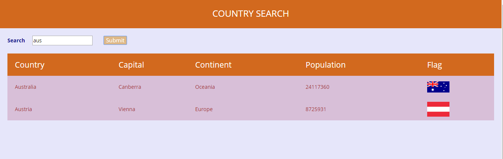

Installation
------------

Ensure that node is installed, then clone or download the repo and type 'npm install' in the console or terminal from within the root folder.

Building the application
------------------------
Within the root folderType, 'npm run build', it uses webpack to build the application

Running the application
-----------------------

Again from within the root folder, type  'npm run start' and visit localhost:8080 in the browser.

Usage:
------

This application fetches you the details of a country viz. Name, Capital, Population, Continent and Flag based on the keyword searched for.
For a blank search it will fetch the details of all the countries.

Example:
--------

On searching for a keyword “ind”, it will fetch the details for British Indian Ocean Territory , India and Indonesia.

On searching for a keyword “aus”, it will fetch the details for Australia and Austria.

Screenshot
----------

